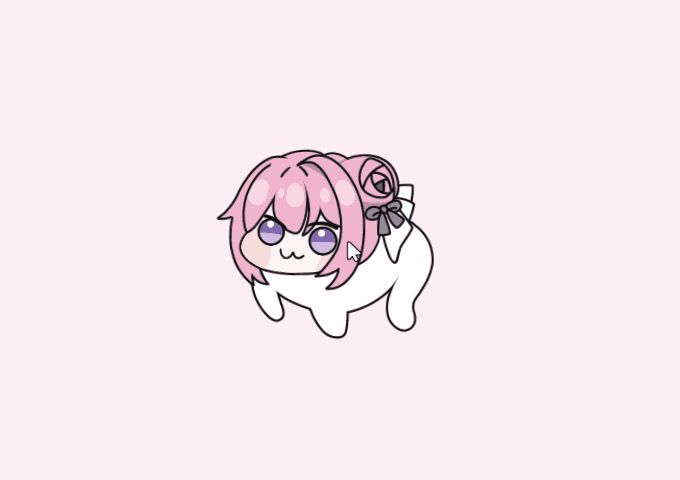
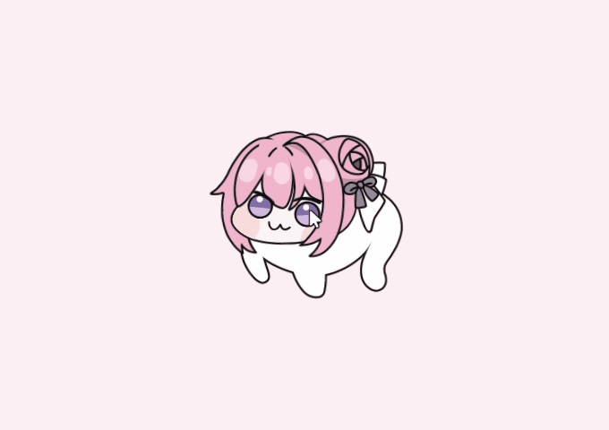
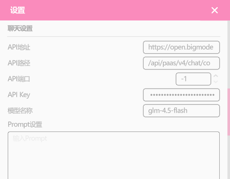

<h1 style="text-align: center; margin-top: -10px;">Dororo</h1>

一款基于Godot的开源桌面宠物项目

Dororo是一款基于Godot的开源桌面宠物项目，其灵感来源于游戏《NIKKE：胜利女神》中的角色桃乐丝（Dorothy）。这个可爱的Q版生物形象源自近期网络上广为流传的一个流行Meme，它以一种幽默而独特的方式重新诠释了原角色。

# ✨ 介绍

该软件使用Godot 4.4.1 开发，目前仅支持Windows平台，软件功能包括：
- 置顶：支持置顶窗口
- 闲逛：支持随机游走
- 鼠标跟随：支持Doro视角跟随鼠标
- 抚摸：支持Doro抚摸，触摸不同区域会有不同的反应
- 边缘吸附：可吸附至屏幕任意边缘
- 自动隐藏：当有全屏应用时自动隐藏
- 大模型聊天：可连接大模型API进行对话，支持OpenAI协议的接口

更多功能正在开发中，敬请期待。

# 🖱️ 基础操作

鼠标左键：移动窗口

鼠标滚轮：放大/缩小窗口

鼠标右键：抚摸

鼠标中键：打开/关闭工具栏

移动至屏幕边缘以吸附

# 🤖 聊天API设置

聊天API设置页面

本项目理论上支持所有OpenAI协议的接口，目前已在Ollama、智谱清言、讯飞星火大模型测试通过。项目支持Prompt设置、流式传输、温度系数等设置。
1. 在大模型API网站获取API Key。
2. 通过工具栏打开设置页面，在聊天设置板块中填写API地址、路径、端口号以及API密钥
   > 以智谱清言为例，其对话补全API链接为：https://open.bigmodel.cn/api/paas/v4/chat/completions \
   > 在API地址一栏填写：https://open.bigmodel.cn \
   > 在API路径一栏填写：/api/paas/v4/chat/completions \
   > 在API Key一栏填写申请的API Key \
   > 在模型名称一栏填写模型名称，如 `glm-4.5-flash`
* 在填写API地址与API路径时，须确保该API地址与API路径拼接后为正确的URL。错误示范：若API地址填写为 https://open.bigmodel.cn/ ，API路径填写为 /api/paas/v4/chat/completions，则API地址与API路径拼接后为 https://open.bigmodel.cn//api/paas/v4/chat/completions ，此时会由于拼接后的URL多出一个/导致无法访问API。
* 若没有指定的端口号，则须将端口号置为-1，此时将使用默认的端口。

# ⭐️ Star趋势

# ⚠️ 版权和授权
使用本项目代码请遵守项目[协议](https://github.com/MelanTech/Dororo/blob/master/LICENSE) ，请勿将该项目用于商业用途。

# ❤️ 鸣谢
- 感谢 [0x4682B4](https://afdian.com/a/0x4682B4) 无私分享的 [Dororong Live2D](https://afdian.com/p/181458b4353211efa9f352540025c377) 模型，请注意模型作者与原型版权方的相关规定。
- 感谢 [ibitsu_paint](https://x.com/ibitsu_paint) 提供的 [Doro 鼠标指针](https://x.com/ibitsu_paint/status/1788513498827518292) ，本项目修改了该鼠标指针中的美术资源作为软件图标。
- 感谢 [MizunagiKB](https://github.com/MizunagiKB) 提供的 [Godot Live2D](https://github.com/MizunagiKB/gd_cubism/) 插件。
- 感谢 [HotariTobu](https://github.com/HotariTobu) 提供的 [gd-data-binding](https://github.com/HotariTobu/gd-data-binding) 插件。
- 感谢所有为本项目提供建议与意见的热心网友。