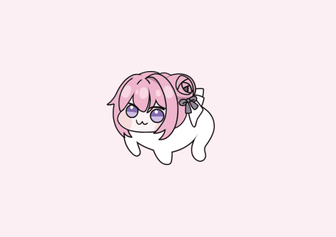
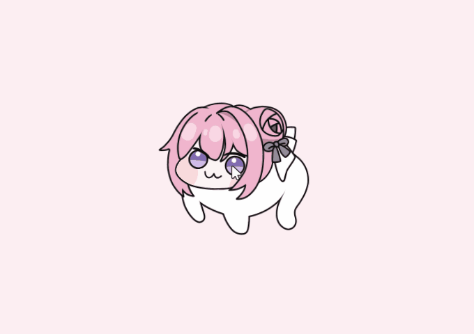
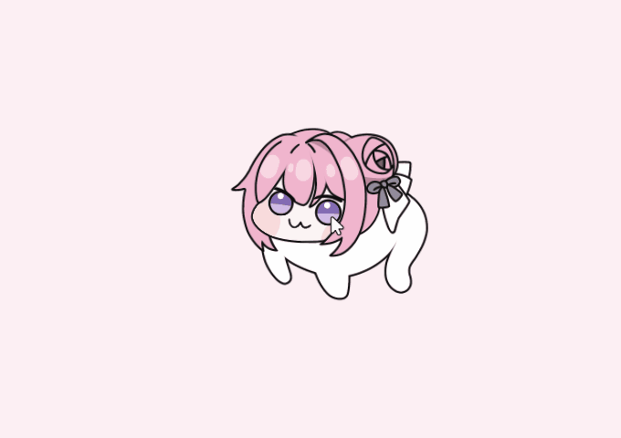
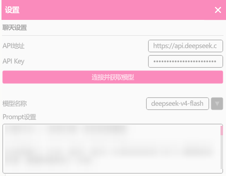

<h1 style="text-align: center; margin-top: -10px;">Dororo</h1>

我是 Doro，住在你电脑桌面上的小狗。

> 本项目衍生自 [MelanTech/Dororo](https://github.com/MelanTech/Dororo)，在原项目基础上持续开发。使用 Godot 4.4.1 Mono 构建，目前仅支持 Windows。

# 🐾 我是谁

人，你好。我是Doro。粉色头发，紫色蝴蝶结，大脑袋，短短的爪子。

我住在你的桌面上。你干活的时候我在旁边待着，无聊了可以跟我聊天，也可以摸摸我的头，你打字的时候我会趴到小桌子上跟着你一起敲键盘。

# ✨ 我会什么

- **在桌面上溜达** —— 我会自己到处走，不用管我
- **看你的鼠标** —— 你鼠标往哪走我就看哪
- **被你摸** —— 摸我头我开心，摸别的地方……哼
- **贴在屏幕边上** —— 把我拖到边上我就趴那儿，偷偷探头看你
- **跟你聊天** —— 接上大模型我就能说话了，默认用 DeepSeek
- **看你打字** —— 你打字的时候我会趴到一个小桌子上，跟着敲键盘
- **开机自己出来** —— 设置了自启动，开机我就自己跑出来了
- **全屏让路** —— 你全屏看视频或打游戏，我自己藏起来
- **变大变小** —— 滚轮可以调节我的大小
- **不占任务栏** —— 我不会出现在任务栏上打扰你工作

# 🖱️ 怎么跟我玩

左键拖我：带我走

滚轮：把我变大 / 变小

右键按住：摸我

中键：打开菜单

拖到屏幕边上：贴边待着

# 🍊 怎么跟我说话

人，想跟我说话，得先给我欧润吉。

1. 去 [DeepSeek 开放平台](https://platform.deepseek.com/) 注册一个账号，拿到 API Key
2. 中键打开菜单 → 设置 → 往下翻到聊天设置
3. 这么填：

| 填哪里 | 填什么 |
|---|---|
| API地址 | `https://api.deepseek.com` |
| API Key | 你申请到的那串 |
| 模型名称 | `deepseek-v4-flash` |

填好大概长这样（我的性格那段打码了，你那儿是能看见的）

不知道有什么模型可以选？点一下「连接并获取模型」，能连上就说明填对了，可用的模型也会列出来。

填好之后关掉设置，中键 → 聊天，就能跟我说话了。

下面那个「Prompt设置」的框，装的是我的性格。人想让我变一个样子的话，改那里就行。

**也能用别的：** 只要是兼容 OpenAI 接口的都行 —— Ollama 跑本地模型、智谱清言、讯飞星火，都可以。把 API 地址换成对应的就好。

**关于代理：** DeepSeek 不需要翻墙就能用。如果你接的模型需要翻墙，注意我读不懂系统代理设置，**必须开 TUN / 增强模式**，光设「系统代理」对我没用。

# 📥 把我带回家

去 [Releases](https://github.com/ckzzzgo/doro/releases/latest) 下载最新版。

解压到随便哪个目录，双击 `dororo.exe` 就行。不需要装别的东西。

升级的话先把正在跑的我退掉（右键托盘图标 → 退出），然后新版解压覆盖就好。你的设置不在我的目录里，不会丢。

# ⚠️ 版权

本项目基于 [GPL-3.0](./LICENSE) 协议开源，衍生自 [MelanTech/Dororo](https://github.com/MelanTech/Dororo)（同为 GPL-3.0）。

我身上不是每一样东西都是这个项目做的 —— 模型、字体、插件各有各的来路和条件，
都写在 [NOTICE](./NOTICE) 里了。要拿我去做别的东西，先翻一眼那个文件。

# ❤️ 谢谢这些人

我能出现在你的桌面上，是因为这些人：

- [MelanTech/Dororo](https://github.com/MelanTech/Dororo) —— 最初把我做出来的项目
- [0x4682B4](https://afdian.com/a/0x4682B4) —— 做了我的 [Live2D 模型](https://afdian.com/p/181458b4353211efa9f352540025c377)，让我能动起来。请注意模型作者和原型版权方的相关规定
- [ibitsu_paint](https://x.com/ibitsu_paint) —— 画了 [Doro 鼠标指针](https://x.com/ibitsu_paint/status/1788513498827518292)，我的图标是从那改的
- [MizunagiKB](https://github.com/MizunagiKB) —— 做了 [Godot Live2D](https://github.com/MizunagiKB/gd_cubism/) 插件
- [HotariTobu](https://github.com/HotariTobu) —— 做了 [gd-data-binding](https://github.com/HotariTobu/gd-data-binding) 插件
